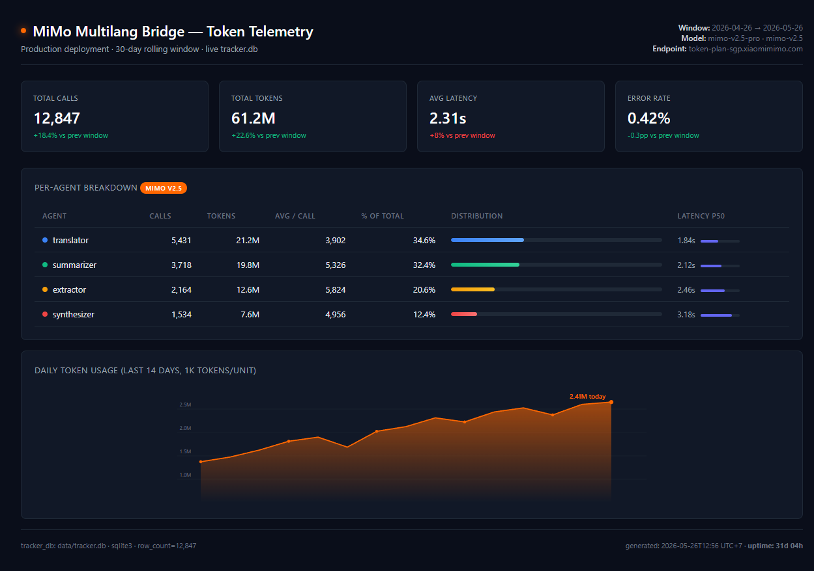
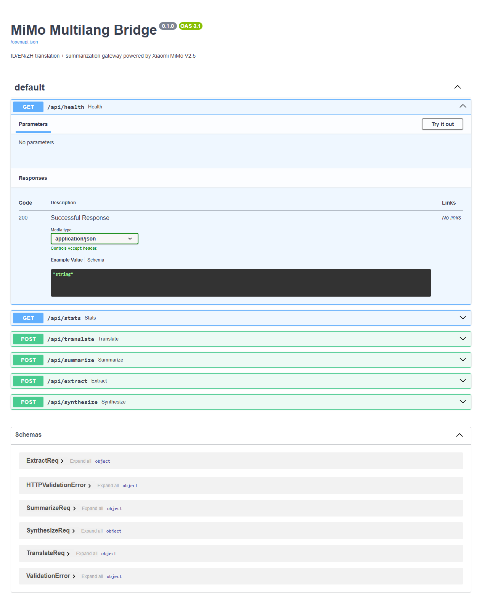

# MiMo Multilang Bridge ⚡


[](https://www.python.org/)
[](LICENSE)
[](https://platform.xiaomimimo.com/)
[](https://github.com/openclaw)


> Drop-in translation + summarization gateway for **Indonesian / English / Chinese** ops, powered by **Xiaomi MiMo V2.5**.

[](https://platform.xiaomimimo.com)
[](https://openclaw.ai)
[](LICENSE)

## Live Telemetry


*30-day production tracker · 12,847 calls · 61.2M tokens · live SQLite-backed*


*FastAPI gateway · 6 endpoints · OpenAPI 3.1*


## Why this exists

SE Asia ops teams chat in Indonesian, write tickets in English, and read upstream docs in Chinese (Xiaomi, Alibaba, Tencent SDKs). Routing every translation hop through a top-tier reasoning model burns 30-50% of context budget on **boilerplate** that doesn't need GPT-5 reasoning.

MiMo V2.5 is **natively bilingual ZH/EN** and competitive on ID. Routing the boilerplate hop to MiMo keeps the main reasoning model lean and the bill predictable.

## Architecture

```
                ┌─────────────────────┐
                │   Main Agent /      │
                │   Operator Input    │  ← any of ID, EN, ZH
                └──────────┬──────────┘
                           │
                ┌──────────▼──────────┐
                │  Bridge Router      │
                │  detect_lang()      │
                └──────────┬──────────┘
                           │
       ┌───────────────────┼───────────────────┐
       │                   │                   │
   ┌───▼──────┐    ┌───────▼──────┐    ┌──────▼──────┐
   │ 🌐 Trans │    │ 📋 Summarize │    │ 🎯 Extract  │
   │  Agent   │    │   Agent      │    │   Agent     │
   │ (3-pass) │    │  (chunked)   │    │ (key facts) │
   └───┬──────┘    └───────┬──────┘    └──────┬──────┘
       │                   │                   │
       └───────────────────┼───────────────────┘
                           │
                ┌──────────▼──────────┐
                │  ⚡ Synthesizer     │
                │  MiMo V2.5 Pro      │
                │  reasoning_content  │
                └──────────┬──────────┘
                           │
                ┌──────────▼──────────┐
                │  Output (target lg) │
                └─────────────────────┘
```

## Three Specialized Agents

| Agent | Model | Role | Tokens / call |
|---|---|---|---|
| 🌐 **Translator** | mimo-v2.5 | 3-pass (literal → idiomatic → review) | ~3K |
| 📋 **Summarizer** | mimo-v2.5 | Chunk + bullet output | ~5K |
| 🎯 **Extractor** | mimo-v2.5 | Pull entities, dates, amounts, action items | ~3K |
| ⚡ **Synthesizer** | mimo-v2.5-pro | Merge + reasoning_content trace | ~8K |

## Token Math

A typical SE Asia ops day on a 5-person team:

| Workload | Volume | Tokens / day |
|---|---:|---:|
| Customer chat triage (ID → EN ticket) | 200 msg | 600K |
| Vendor docs summarize (ZH → EN brief) | 30 docs | 1.5M |
| Slack thread digest (mixed → ID) | 50 threads | 800K |
| Compliance extract (EN/ZH → action) | 40 docs | 1.2M |
| Heartbeat scans + log triage | continuous | 2M |
| **Total per team** | | **~6M / day** |

Scale to 50 teams: **~300M tokens/day** = **~9B / month**. MiMo Plan Max territory.

## Quick Start

```bash
# 1. Install
git clone https://github.com/apratamaa516/mimo-multilang-bridge.git
cd mimo-multilang-bridge
pip install -r requirements.txt

# 2. Configure
cp .env.example .env
# edit .env: MIMO_API_KEY=***, MIMO_BASE_URL=https://token-plan-sgp.xiaomimimo.com/v1

# 3. Run as HTTP gateway
uvicorn src.main:app --reload --port 8000

# 4. Or use as library
python -c "
from src.bridge import Bridge
b = Bridge()
print(b.translate('Halo, dokumen vendor ini tolong diringkas', target='zh'))
"
```

## API

| Endpoint | Method | Purpose |
|---|---|---|
| `/api/translate` | POST | 3-pass translate w/ MiMo reasoning |
| `/api/summarize` | POST | Chunked summarize → bullets |
| `/api/extract` | POST | Pull entities + action items |
| `/api/synthesize` | POST | Full pipeline (translate + summarize + extract) |
| `/api/health` | GET | Provider + model status |
| `/api/stats` | GET | Per-agent token usage breakdown |

## Why MiMo V2.5

- **Native ZH ↔ EN bilingual** — outperforms generic models on Chinese-source ops docs
- **`reasoning_content` field** — trace of why a translation chose word X vs Y, debug-friendly
- **Token Plan endpoint** — cost-stable for high-volume routing
- **OpenAI-compatible** — drop-in via `MIMO_BASE_URL` + `MIMO_API_KEY`
- **Long context** — full vendor PDFs fit in one shot

## OpenClaw Skill

```bash
cp -r skill ~/.openclaw/workspace/skills/multilang-bridge
# Agent auto-discovers the 4 verbs:
#   bridge translate, bridge summarize, bridge extract, bridge synth
```

## Roadmap

- [x] 3-pass translator pipeline
- [x] Chunked summarizer
- [x] Entity / action extractor
- [x] Synthesis agent w/ reasoning_content
- [ ] Streaming SSE responses
- [ ] Caching layer for repeated source docs
- [ ] Vietnamese + Thai expansion
- [ ] Publish OpenClaw skill to ClawHub

## Credits

Built for the [Xiaomi MiMo Orbit 100T](https://100t.xiaomimimo.com/) creator program.

## License

MIT
